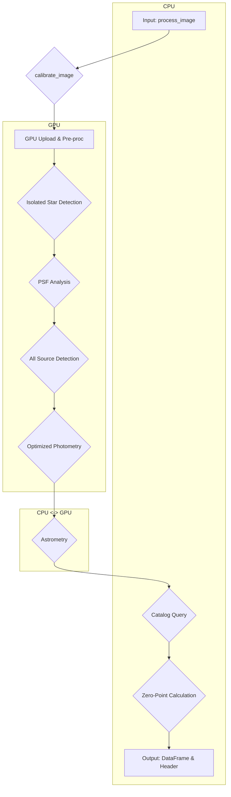

# GPUPhot: Execution Flow and Data Processing Analysis

**Version:** 2.0
**Date:** 2026-03-24
**Consolidated from:** callgraph iterations 1-5, process_image_flow.md, process_image_flow_tree.md, process_image_kwargs.md, PARAMETER_CONSISTENCY.md

---

## 1. Overview

This document provides a comprehensive technical analysis of the `GPUPhot` processing pipeline, starting from the main entry point `process_image`. It details the function call flow, the movement of data between CPU and GPU, the impact of configuration parameters, fallback mechanisms, and memory management strategies.

The pipeline can be summarized into the following main phases:

1. **Initialization and Configuration**: Loading of instrument-specific parameters.
2. **Pre-processing and Calibration**: Image preparation, including background estimation and artifact cleaning.
3. **PSF Analysis**: Detection of isolated stars to model the Point Spread Function (PSF) across the entire image.
4. **Source Detection**: Identification of all potential sources in the image.
5. **Optimized Photometry**: Performing aperture photometry with a radius optimized to maximize the signal-to-noise ratio (SNR) for each source.
6. **Astrometric and Photometric Calibration**: Astrometric solving of the image and calculation of the photometric zero-point by comparison with a reference catalog.
7. **Final Catalog Generation**: Assembling all results into a final `pandas.DataFrame`.

---

## 2. High-Level Flowchart



---

## 3. Detailed Execution Flow

### 3.1 `process_image` -- `gpuphot/phot/photo_gpu.py:625-697`

- **Type:** Mixed (CPU orchestrating GPU calls)
- **Purpose:** Entry point. Merges default parameters with user kwargs, calls `calibrate_image`, and updates the FITS header with astrometry/photometry results.
- **Decorated with:** `@capture_cuda_exception` (catches CUDA errors globally)
- **Finally block:** `reset_cupy_allocators()` (line ~697) ensures GPU memory cleanup.
- **Direct calls:**
  - `calibrate_image(...)` (call @669)
  - `update_header_with_astrometry(...)` (call @690)
  - `update_header_with_photometry(...)` (call @692)
- **Parameter merge:** `params = {**DefaultConfig.DEFAULT_PROCESSING_PARAMS, **kwargs}` (line 666), then `calibrate_image(..., **params)`.

### 3.2 `calibrate_image` -- `gpuphot/phot/photo_gpu.py:2837-3145`

This is the main orchestrating function. All major pipeline stages happen here.

| Step | Function/Operation | Location | Type | Description |
| :--- | :--- | :--- | :--- | :--- |
| 1 | `cp.asarray(imdata)` | line ~2895 | CPU->GPU | Raw image transferred to GPU memory. **Main transfer point.** |
| 2 | `get_local_background_fft` | line ~2903 | GPU | Background and RMS estimation using FFT on GPU. |
| 3 | `CR_filter` / `SP_filter` | line ~2923-2929 | GPU | Cosmic ray / salt-and-pepper noise cleaning. |
| 4 | `detect_isolated_stars` | line ~2934 | Mixed | Detects bright, non-overlapping stars for PSF modeling. Uses KDTree on CPU (.get() transfer). |
| 5 | `create_star_dataset` | line ~2944 | GPU | Crops stamp images around detected isolated stars. |
| 6 | `stack_sigmaclip` | -- | GPU | Stacks reference star stamps to create master PSF. |
| 7 | `fit_moffat` | -- | Mixed | Fits Moffat profile to master PSF. Transfers via `cp.asnumpy()` for `lmfit` (CPU). |
| 8 | **PCA Analysis** (optional) | line ~2988-3003 | GPU | If `pca_method=True`: `get_eigen_psfs` (GPU->CPU transfer for PCA.fit), `project_all_stars_onto_eigenpsfs`, `create_coeff_map`. |
| 9 | `detect_sources_psf` | -- | GPU | PSF-convolved source detection exceeding SNR threshold. |
| 10 | `perform_opt_photometry` | line ~3039 | Mixed | **Critical sub-pipeline.** Returns final results to CPU via `.get()`. |
| 11 | `astrometrice2` | -- | CPU | Astrometric calibration against catalog, generating WCS header. |
| 12 | `catalog_results` | line ~3108 | CPU | Queries reference catalog (Vizier or custom function). |
| 13 | `get_zeropoint` | -- | CPU | Calculates photometric zero-point, color terms. |
| 14 | `crossmatch_sources` | -- | Mixed | Final cross-match between detected sources and catalog. |

---

## 4. Detailed Node Descriptions

### 4.1 Background Estimation

#### `get_local_background_fft` -- `gpuphot/phot/background.py:26-89`
- **Type:** GPU
- **Purpose:** Estimates local sky background and optionally RMS, using Gaussian filtering and FFT-based tiling.
- **Transfers:** `cp.array(image)` (CPU->GPU) at line ~52 if input is NumPy.
- **Calls:**
  - `get_mean_std(...)` -- `gpuphot/phot/conv.py:85-109` (GPU, calls `gen_apm_filter` + `convolve_fft`)
  - `fill_nan_fft(...)` -- `gpuphot/phot/conv.py:294-319` (GPU, iterative NaN filling)
  - `decompose_into_tiles(...)` / `calculate_tile_percentiles(...)` / `recompose_from_percentiles(...)` -- tiling utilities
  - `free_gpu_mem()` -- explicit GPU memory management at multiple points

### 4.2 Convolution Utilities (`gpuphot/phot/conv.py`)

| Function | Lines | Type | Purpose |
| :--- | :--- | :--- | :--- |
| `convolve_fft` | 28-80 | GPU | FFT convolution with optional padding. Uses `cp.fft.rfft2`/`irfft2`. Memory-sensitive due to padding. |
| `get_mean_std` | 85-109 | GPU | Mean/std calculation via aperture filter + FFT convolution. |
| `gaussian_kernel` | 114-131 | GPU | Generates Gaussian kernel on GPU (`cp.linspace`, `cp.meshgrid`, `cp.exp`). Used by `detect_isolated_stars`. |
| `get_aper_kernel` | 164-187 | GPU | Generates circular aperture kernel and area. Used extensively by `batch_aperture_photometry`. |
| `fill_image` | 191-203 | Neutral | Shape calculation (rounds to powers of 2 for FFT). |
| `gen_apm_filter` | 208-244 | GPU | Generates normalized circular aperture mask. |
| `batch_aper_kernel` | 249-289 | GPU | Vectorized batch kernel generation for multiple radii. |
| `fill_nan_fft` | 294-319 | GPU | NaN filling using convolution and neighbor masks. |

### 4.3 PSF Detection and Analysis (`gpuphot/phot/psf.py`)

#### `detect_isolated_stars` -- `gpuphot/phot/psf.py:124-218`
- **Type:** Mixed (GPU convolutions + CPU KDTree)
- **Transfers:**
  - `coor_f.get()` (GPU->CPU) at line ~187 for KDTree distance calculation
  - `snr[m].get()` at line ~195 for sorting metrics
- **Calls:**
  - `gaussian_kernel(...)` -- `conv.py:114-131` (GPU kernel generation)
  - `detect_sources_psf(...)` -- `psf.py:692-728` (GPU convolution-based detection)
  - `get_centroids_distance_kdtree(coor_f.get())` -- `psf.py:914-926` (CPU, scipy KDTree)

#### `create_star_dataset` -- `gpuphot/phot/psf.py:223-334`
- **Type:** GPU
- **Purpose:** Creates cutout stamps per star. Converts inputs to CuPy if NumPy.
- **Transfers:** None explicit; operates on GPU arrays.

#### `get_eigen_psfs` -- `gpuphot/phot/psf.py:558-586`
- **Type:** Mixed
- **Transfers:** `normed_star_dataset.reshape(...).get()` (GPU->CPU) at line ~581 before PCA.fit.
- **Optional deps:** cuML PCA (fallback to sklearn PCA).

#### `project_all_stars_onto_eigenpsfs` -- `gpuphot/phot/psf.py:591-608`
- **Type:** GPU
- **Purpose:** Projects all stars onto EigenPSFs. Matrix operations on CuPy arrays.
- **Called from:** `calibrate_image` (lines ~2998, 3013).

#### `create_coeff_map` -- `gpuphot/phot/psf.py:613-656`
- **Type:** GPU
- **Calls:** `fill_nan_fft` (line ~634), `calculate_tile_nanmean_sigclip`, tiling utilities.

#### `calculate_kernel_area` -- `gpuphot/phot/psf.py:661-687`
- **Type:** GPU
- **Purpose:** Calculates PSF kernel area via convolution.
- **Called from:** `detect_sources_psf` (line ~722).

#### `detect_sources_psf` -- `gpuphot/phot/psf.py:692-728`
- **Type:** GPU
- **Purpose:** Source detection using PSF convolution (and PCA-augmented convolutions if eigen PSFs available).
- **Calls:** `convolve_fft`, `calculate_kernel_area`, `find_local_max`, `find_local_centroid`.

#### `fit_moffat` -- `gpuphot/phot/psf.py:805-892`
- **Type:** Mixed
- **Transfers:** `cp.asnumpy(r)` and `cp.asnumpy(Z)` (GPU->CPU) at lines ~867-868 for `lmfit` fitting (CPU-bound).
- **Calls:** `moffat()` (line ~930, model function), `moffat_fwhm()` (line ~955, FWHM from parameters).

#### Helper functions (not in main flow but supporting):

| Function | Lines | Type | Purpose |
| :--- | :--- | :--- | :--- |
| `find_local_max` | 59-75 | GPU | Peak detection via `cp.maximum_filter`. |
| `find_local_centroid` | 80-119 | GPU | Sub-pixel centroid refinement. |
| `get_centroids_distance_kdtree` | 914-926 | CPU | KDTree-based distance calculation (scipy). |
| `moffat` | 930-951 | CPU | Moffat profile model (used by `lmfit`). |
| `moffat_fwhm` | 955-983 | CPU | FWHM from Moffat fit parameters. |
| `recreate_normed_star` | 732-749 | GPU | Reconstruct normalized star from EigenPSFs. |

### 4.4 Optimized Photometry

#### `perform_opt_photometry` -- `gpuphot/phot/photo_gpu.py:701-1009`
- **Type:** Mixed (GPU intensive with punctual CPU transfers)
- **Purpose:** Star selection, aperture correction maps, batch photometry, SNR optimization.
- **Final transfers:** `opt_signal.get()`, `opt_total_noise.get()`, `opt_coords.get()` (GPU->CPU) at line ~1009.

| Step | Function/Operation | Type | Description |
| :--- | :--- | :--- | :--- |
| 1 | Star Selection | GPU | Selects isolated, high-SNR stars in center of image (`center_factor`, `min_conv_snr`). |
| 2 | `crossmatch_sources` | Mixed | Cross-matches for star validation. cuML/CPU fallback. |
| 3 | `create_aperture_corrections_map_gpu` | Mixed | Groups reference stars, calculates growth curves per group. |
| 4 | `find_aperture_corrections_gpu` | GPU | Assigns aperture corrections to each source. |
| 5 | `batch_aperture_photometry` | GPU | Measures flux through multiple aperture radii. Most compute-intensive. |
| 6 | SNR per Radius | GPU | Calculates SNR for each aperture radius on reference stars. |
| 7 | `np.polyfit` | CPU | Linear fit (log-log) between conv SNR and optimal radius. Transfer: `.get()` for polyfit data (~line 900). |
| 8 | Apply Relationship | GPU | Predicts optimal radius for all sources. |
| 9 | Final Measurement + Return | GPU->CPU | Extracts flux/noise at optimal radius, `.get()` transfers. |

#### `create_aperture_corrections_map_gpu` -- `gpuphot/phot/photo_gpu.py:389-565`
- **Type:** Mixed
- **Transfers:**
  - `aperture_curves_cp.get()` (GPU->CPU) in CPU fallback path (~line 496)
  - `cp.asarray(aperture_corrections_np)` (CPU->GPU) at ~line 550
- **Calls:**
  - `batch_aperture_photometry(...)` (call @418)
  - `group_star_dataset(...)` (call @431) -- wrapper with GPU/CPU dispatch
  - `calculate_aperture_corrections_gpu(...)` (call @468) -- GPU aperture correction calculation

#### `calculate_aperture_corrections_gpu` -- `gpuphot/phot/photo_gpu.py:179-250`
- **Type:** GPU
- **Purpose:** Core aperture correction calculation on GPU arrays.

#### `find_aperture_corrections_gpu` -- `gpuphot/phot/photo_gpu.py:302-353`
- **Type:** GPU
- **Calls:** `crossmatch_sources(...)` for GPU-based indexing.

#### `batch_aperture_photometry` (v4) -- `gpuphot/phot/photo_gpu.py:1789-2423`
- **Type:** GPU (accepts NumPy, transfers to GPU if needed)
- **Purpose:** FFT-based aperture photometry with CUDA streams for concurrency.
- **Transfers:** `cp.asarray(img_ori_input)` (CPU->GPU) at ~line 1839 if input is NumPy.
- **OOM handling:** Try/except with `mempool.free_all_blocks()`, retry or return None.
- **Internal:** `process_plane` (lines 1990-2201) -- inner function using streams.
- **Calls:** `get_aper_kernel(...)`, `fill_image(...)`, `cp.fft.rfft2`/`irfft2`.

### 4.5 Star Grouping (GPU/CPU Fallback)

#### `group_star_dataset` -- `gpuphot/phot/psf.py:485-553`
- **Type:** Mixed (wrapper with GPU/CPU dispatch)
- **Decision logic:**
  ```
  if is_gpu_input and CUML_CLUSTERING_AVAILABLE:
      try _group_star_dataset_gpu_impl (cuML AgglomerativeClustering)
      except: fallback to CPU (transfer coords.get())
  else:
      _group_star_dataset_cpu_impl (sklearn AgglomerativeClustering)
  ```
- **Transfers on fallback:** `coords.get()` (GPU->CPU, line ~526), `cp.asarray(result)` (CPU->GPU, line ~534).

#### `_group_star_dataset_gpu_impl` -- `gpuphot/phot/psf.py:406-479`
- **Type:** GPU (cuML clustering + pairwise distances)
- **Optional dep:** `cuml.cluster.AgglomerativeClustering`, `cuml.metrics.pairwise_distances`

#### `_group_star_dataset_cpu_impl` -- `gpuphot/phot/psf.py:338-401`
- **Type:** CPU (sklearn AgglomerativeClustering + scipy distances)

### 4.6 Cross-matching (GPU/CPU Fallback)

#### `crossmatch_sources` -- `gpuphot/utils/catalog.py:138-215`
- **Type:** Mixed (wrapper)
- **Decision logic:**
  ```
  if is_gpu_input and CUML_AVAILABLE:
      try _crossmatch_sources_gpu_impl (cuML NearestNeighbors)
      except: fallback to CPU
  else:
      _crossmatch_sources_cpu_impl (scipy KDTree)
  ```
- **Transfers on fallback:**
  - `source_coords.get()`, `ref_coords.get()` (GPU->CPU, lines ~187-188)
  - `cp.asarray(result_np)` (CPU->GPU, lines ~205-207)

#### `_crossmatch_sources_gpu_impl` -- `gpuphot/utils/catalog.py:48-92`
- **Type:** GPU (cuML NearestNeighbors on CuPy arrays)

#### `_crossmatch_sources_cpu_impl` -- `gpuphot/utils/catalog.py:97-133`
- **Type:** CPU (scipy KDTree)

### 4.7 Catalog Query and Photometric Calibration

#### `catalog_results` -- `gpuphot/utils/catalog.py:401-553`
- **Type:** CPU (network + Pandas)
- **Purpose:** Queries Vizier (or custom function) for reference catalog, post-processes results.
- **Calls:** `__getVizier(...)`, `calculate_ps1_solar_index(...)`, `calculate_gaia_solar_index(...)`.

#### `__getVizier` -- `gpuphot/utils/catalog.py:256-352`
- **Type:** CPU (network)
- **Decision:** If `custom_vizier_search_func` is provided, runs it via `TimeoutExecutor`. On timeout/error/invalid result, falls back to standard Vizier query.
- **Validation:** Uses `_is_valid_result(...)` (line 218-251) to check DataFrame validity.

---

## 5. Data Transfers Summary (CPU <-> GPU)

The pipeline minimizes data transfers. All critical transfer points:

### CPU -> GPU (Input)
| Location | Operation | Data Size |
| :--- | :--- | :--- |
| `calibrate_image:2895` | `cp.asarray(imdata)` | Full image (largest transfer) |
| `batch_aperture_photometry:1839` | `cp.asarray(img_ori_input)` | Full image (if NumPy input) |
| `crossmatch_sources:205` | `cp.asarray(result_np)` | Small index arrays (fallback) |
| `group_star_dataset:534` | `cp.asarray(result)` | Small label arrays (fallback) |

### GPU -> CPU (During Processing)
| Location | Operation | Data Size | Reason |
| :--- | :--- | :--- | :--- |
| `detect_isolated_stars:187` | `coor_f.get()` | Moderate (star coords) | KDTree requires NumPy |
| `get_eigen_psfs:581` | `.get()` on star dataset | Moderate (flattened stars) | PCA.fit requires NumPy |
| `fit_moffat:867-868` | `cp.asnumpy(r)`, `cp.asnumpy(Z)` | Small (PSF profile) | lmfit requires NumPy |
| `perform_opt_photometry:~900` | `.get()` on SNR/radii | Small (reference stars) | np.polyfit requires NumPy |
| `create_aperture_corrections_map_gpu:496` | `.get()` on curves | Moderate (fallback path) | CPU calculation fallback |
| `crossmatch_sources:187-188` | `.get()` on coords | Small (fallback path) | CPU KDTree fallback |
| `group_star_dataset:526` | `coords.get()` | Small (fallback path) | CPU clustering fallback |

### GPU -> CPU (Final Output)
| Location | Operation | Data Size |
| :--- | :--- | :--- |
| `perform_opt_photometry:1009` | `opt_signal.get()`, `opt_total_noise.get()`, `opt_coords.get()` | Final photometry arrays |

---

## 6. Conditional Branches and Fallback Mechanisms

### 6.1 cuML Availability

Two independent flags control GPU-accelerated library usage:

- **`CUML_AVAILABLE`** (`gpuphot/utils/catalog.py:35-43`): Controls GPU cross-matching via cuML NearestNeighbors.
- **`CUML_CLUSTERING_AVAILABLE`** (`gpuphot/phot/psf.py:28-42`): Controls GPU clustering via cuML AgglomerativeClustering.

Both are set at import time via try/except on `import cuml`. On ARM/Jetson platforms, cuML is unavailable, so CPU fallbacks always activate.

### 6.2 OOM Handling

No global OOM flag exists. The pattern is reactive:
```
try:
    GPU operation
except Exception:
    mempool.free_all_blocks()
    retry with reduced parameters / fallback to CPU / return None
```

Key locations:
- `batch_aperture_photometry` -- returns `None` on OOM
- `create_aperture_corrections_map_gpu` -- falls to CPU path
- `group_star_dataset` -- falls to CPU implementation
- `crossmatch_sources` -- falls to CPU KDTree

### 6.3 Pipeline Error Handling

| Exception | Where | Trigger |
| :--- | :--- | :--- |
| `InsufficientStarsError` | `calibrate_image`, `perform_opt_photometry` | Too few stars detected |
| `MoffatFitError` | `calibrate_image` (try/except around `fit_moffat`) | PSF fitting failure |
| `UnableToAstrometrizeError` | `process_image` | `calibrate_image` returns None |
| `@capture_cuda_exception` | `process_image` decorator | Any uncaught CUDA error |

---

## 7. Configuration Parameters (`DEFAULT_PROCESSING_PARAMS`)

Source: `gpuphot/instrument_config_parser.py:114-129`

Parameters merge: `ImageProcessor.process_image` builds `params = {**self.processing_params, **kwargs}`, so any kwarg overrides the default.

| Parameter | Default | Where Consumed | Description |
| :--- | :--- | :--- | :--- |
| `border` | `20` | `calibrate_image` | Pixels to ignore at image edges for detection. |
| `center_factor` | `0.7` | `calibrate_image` | Fraction of central image for reference star selection. |
| `color_range` | `0.6` | `get_zeropoint` | Color range around solar color for ZP star selection. |
| `CR_filt` | `False` | `calibrate_image` | Enable cosmic ray filter. |
| `do_pad` | `True` | `convolve_fft` | Pad images before FFT to prevent circular artifacts. |
| `lum_gmag_coeff` | `0.5` | `catalog_results` | Weight for 'g' magnitude in synthetic luminance. |
| `lum_rmag_coeff` | `0.5` | `catalog_results` | Weight for 'r' magnitude in synthetic luminance. |
| `max_stars_ref` | `15` | `calibrate_image` | Max reference stars for PSF building. |
| `min_conv_snr` | `300` | `perform_opt_photometry` | Min conv SNR for growth curve analysis stars. |
| `min_snr` | `5` | `detect_isolated_stars`, `detect_sources_psf` | Min SNR for valid detection. |
| `pca_method` | `True` | `calibrate_image` | Enable PCA-based spatially variable PSF modeling. |
| `SP_filt` | `True` | `calibrate_image` | Enable salt-and-pepper noise filter. |
| `tile_section` | `1000` | `get_local_background_fft`, `create_coeff_map` | Tile size for background/coefficient estimation. |
| `tile_section_psf` | `3000` | `create_aperture_corrections_map_gpu` | Tile size for aperture correction star grouping. |
| `zp_maxmag` | `21` | `calibrate_image`, `catalog_results` | Max magnitude for catalog query. |

### Non-default supported kwargs (not in DEFAULT_PROCESSING_PARAMS):

| Key | Where Consumed | Effect |
| :--- | :--- | :--- |
| `custom_vizier_search_func` | `__getVizier` | Callable for custom catalog queries (fallback to Vizier on error). |
| `vizier_timeout` | `__getVizier` | Timeout for catalog queries. |
| `vizier_row_limit` | `__getVizier` | Row limit for Vizier queries. |
| `vizier_cache` | `__getVizier` | Enable Vizier cache. |
| `expected_columns` | `__getVizier`, `catalog_results` | Expected columns from catalog query for validation. |

---

## 8. Parameter Consistency Audit

Three discrepancies exist between `DEFAULT_PROCESSING_PARAMS` values and function signature defaults:

| Parameter | Config Default | Function Default | Function | Impact |
| :--- | :--- | :--- | :--- | :--- |
| `border` | `20` | `10` | `calibrate_image` | Direct calls use 10px border (more edge contamination) |
| `color_range` | `0.6` | `0.3` | `get_zeropoint` | Direct calls use stricter range (fewer calibration stars) |
| `tile_section_psf` | `3000` | `2500` | `calibrate_image` | Direct calls create smaller tiles (more groups) |

**Recommendation:** Unify function signature defaults with `DEFAULT_PROCESSING_PARAMS` to ensure consistent behavior regardless of call path.

---

## 9. Standalone and Dead Code

Functions defined but not integrated in the main `process_image` pipeline:

| Function | File:Lines | Status | Notes |
| :--- | :--- | :--- | :--- |
| `gen_moff_filter2` | `photo_gpu.py:153-175` | Dead code | Alternative Moffat filter, never called. |
| `calculate_aperture_corrections` | `photo_gpu.py:255-298` | Dead code | Legacy CPU version, replaced by GPU version. |
| `aperture_photometry` | `photo_gpu.py:3150-3169` | Dead code | Superseded by `batch_aperture_photometry`. |
| `get_fwhm_mof` | `photo_gpu.py:3174-3196` | Standalone | ML model inference helper, not integrated. |
| `get_sky` | `photo_gpu.py:116-147` | Standalone | Sky estimation utility, not called from pipeline. |
| `recreate_normed_star_vectorized` | `psf.py:754-777` | Standalone | Unused vectorized variant. |
| `recreate_normed_stars_batch` | `psf.py:781-800` | Standalone | Unused batch variant. |
| `filter_centroids_kdtree` | `psf.py:896-909` | Standalone | Utility not integrated. |

---

## 10. Visual Graph

The annotated call graph is available as:
- **PNG:** `callgraph/process_image_graph_iter6_annotated.png`
- **SVG:** `callgraph/process_image_graph_iter6_annotated.svg`

To regenerate from DOT source:
```bash
dot -Tpng callgraph/process_image_graph_iter6.dot -o callgraph/process_image_graph_iter6.png
dot -Tsvg callgraph/process_image_graph_iter6.dot -o callgraph/process_image_graph_iter6_annotated.svg
```

### Legend (DOT styles)
- **Solid edges:** Normal call flow
- **Dashed edges:** CPU fallback path (when GPU fails or cuML unavailable)
- **Node labels:** Include `path:range / Type / transfers / notes`
- **Annotations:** `[CPU->GPU @line]` for `cp.asarray`, `[GPU->CPU .get() @line]` for explicit transfers
