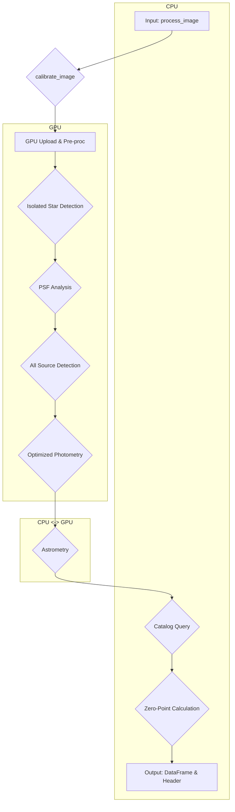

# GPUPhot: Execution Flow and Data Processing Analysis

**Version:** 1.0
**Date:** 2024-08-02

## 1. Overview

This document provides a comprehensive technical analysis of the `GPUPhot` processing pipeline, starting from the main entry point, `process_image`. The goal is to detail the function call flow, the movement of data between the CPU and GPU, and the impact of configuration parameters at each stage.

The pipeline can be summarized into the following main phases:

1.  **Initialization and Configuration**: Loading of instrument-specific parameters.
2.  **Pre-processing and Calibration**: Image preparation, including background estimation and artifact cleaning.
3.  **PSF Analysis**: Detection of isolated stars to model the Point Spread Function (PSF) across the entire image.
4.  **Source Detection**: Identification of all potential sources in the image.
5.  **Optimized Photometry**: Performing aperture photometry with a radius optimized to maximize the signal-to-noise ratio (SNR) for each source.
6.  **Astrometric and Photometric Calibration**: Astrometric solving of the image and calculation of the photometric zero-point by comparison with a reference catalog.
7.  **Final Catalog Generation**: Assembling all results into a final `pandas.DataFrame`.

---

## 2. High-Level Flowchart

---

## 3. Detailed Execution Flow (`process_image`)

The `ImageProcessor.process_image` function acts as a wrapper that first translates the FITS header and then delegates the main work to `gpuphot.phot.photo_gpu.process_image`, which in turn calls `calibrate_image`.

### `calibrate_image(imdata, ...)`

This is the main orchestrating function.

| Step | Function/Operation | Data Source | Data Destination | Relevant Configuration Parameters | Description |
| :--- | :--- | :--- | :--- | :--- | :--- |
| 1 | `cp.asarray(imdata)` | CPU (NumPy) | GPU (CuPy) | - | The raw image is transferred to the GPU's memory. **Main transfer point.** |
| 2 | `get_local_background_fft` | GPU | GPU | `tile_section` | Estimates the sky background and RMS using FFT on the GPU. |
| 3 | `CR_filter` / `SP_filter` | GPU | GPU | `CR_filt`, `SP_filt` | Applies cleaning filters for cosmic rays or salt-and-pepper noise. The processed image is saved as `img`. |
| 4 | `detect_isolated_stars` | GPU | GPU | `border`, `min_snr` | Detects bright, non-overlapping stars that will be used to model the PSF. |
| 5 | `create_star_dataset` | GPU | GPU | `scale` | Crops small stamp images around the detected isolated stars. |
| 6 | `stack_sigmaclip` | GPU | GPU | - | Stacks the reference star stamps to create a high-SNR master PSF. |
| 7 | `fit_moffat` | GPU | CPU | - | Fits a Moffat profile to the master PSF to determine the FWHM. **Implicit GPU->CPU transfer** when operating on the PSF array. |
| 8 | **PCA Analysis (Optional)** | GPU | GPU | `pca_method`, `tile_section` | If `pca_method=True`, it calculates the principal components of PSF variation (EigenPSFs) and a coefficient map describing how the PSF varies across the image. |
| | `get_eigen_psfs` | GPU | GPU | - | Calculates the EigenPSFs. |
| | `project_all_stars_onto_eigenpsfs` | GPU | GPU | - | Projects all stars onto the EigenPSFs. |
| | `create_coeff_map` | GPU | GPU | `tile_section` | Interpolates the coefficients into a 2D map. |
| 9 | `detect_sources_psf` | GPU | GPU | `min_snr` | Performs a convolution of the image with the PSF (or the variable PSF model) to detect all sources exceeding an SNR threshold. |
| 10| `perform_opt_photometry` | GPU | CPU (NumPy) | See Section 4 | **Critical sub-pipeline.** Performs optimized aperture photometry. Returns the final results (flux, noise, coordinates) to the CPU. |
| 11| `astrometrice2` | CPU | CPU | `sip_order` | Uses the highest SNR detections to perform astrometric calibration against a catalog, generating a WCS header. |
| 12| `catalog_results` | CPU | CPU | `custom_vizier_search_func`, `custom_vizier_timeout` | Queries the reference catalog (Vizier or custom) to get stars in the field of view. |
| 13| `get_zeropoint` | CPU | CPU | `color_range`, `zp_maxmag` | Compares instrumental magnitudes with catalog magnitudes to calculate the zero-point (ZP), color terms, and other calibration parameters. |
| 14| `crossmatch_sources` | CPU | CPU | - | Performs a final cross-match between all detected sources and the catalog to add astrometric errors. |

---

## 4. Detailed Analysis of `perform_opt_photometry`

This function is a pipeline in itself, designed to find the optimal aperture radius for each star.

| Step | Function/Operation | Data Source | Data Destination | Relevant Configuration Parameters | Description |
| :--- | :--- | :--- | :--- | :--- | :--- |
| 1 | **Star Selection** | GPU | GPU | `center_factor`, `min_conv_snr` | Selects a subset of isolated, high-SNR stars in the center of the image to serve as calibrators. |
| 2 | `create_aperture_corrections_map_gpu` | GPU | GPU | `tile_section_psf` | **Key step.** Groups reference stars by proximity and calculates a growth curve for each group. This generates a map describing how the growth curve (and thus the aperture correction) varies across the image. |
| 3 | `find_aperture_corrections_gpu` | GPU | GPU | - | Assigns the corresponding aperture correction from the map to each detected source. |
| 4 | `batch_aperture_photometry` | GPU | GPU | - | Measures the flux of **all** sources through a series of apertures with different radii. This is the most computationally intensive operation. |
| 5 | **SNR per Radius Calculation** | GPU | GPU | - | For the reference stars, calculates the SNR for each of the measured aperture radii. |
| 6 | `np.polyfit` | GPU | CPU | - | Finds a relationship (linear fit in log-log space) between a star's convolutional SNR and its optimal aperture radius. **GPU->CPU transfer** of reference star data. |
| 7 | **Apply Relationship**| GPU | GPU | - | Uses the found relationship to predict the optimal radius for **all** other sources based on their convolutional SNR. |
| 8 | **Final Measurement** | GPU | GPU | - | Extracts the flux and calculates the noise for each source at its predicted optimal radius. |
| 9 | `.get()` | GPU | CPU | - | Transfers the final flux, noise, and coordinate arrays from the GPU to the CPU to be returned as NumPy arrays. **Final transfer point.** |

---

## 5. Configuration Parameters Table (`DEFAULT_PROCESSING_PARAMS`)

These parameters can be defined by the user in their JSON configuration file to override the default values.

| Parameter | Default Value | Where It's Used | Description |
| :--- | :--- | :--- | :--- |
| `border` | `20` | `calibrate_image` | Width in pixels of the image border to be ignored during source detection to avoid edge effects. |
| `center_factor`| `0.7` | `calibrate_image` | Fraction of the central image area from which reference stars are selected for PSF analysis. A value of 0.7 uses the central 70%. |
| `color_range` | `0.6` | `get_zeropoint` | Color range (e.g., B-V) around the solar color used to select reference stars for zero-point calculation. |
| `CR_filt` | `False` | `calibrate_image` | If `True`, applies a filter for cosmic ray removal. |
| `do_pad` | `True` | `convolve_fft` | (Low-level parameter) If `True`, pads images before FFT to prevent circular convolution artifacts. |
| `lum_gmag_coeff`| `0.5` | `catalog_results` | Coefficient to weight the 'g' magnitude when calculating a synthetic luminance magnitude if the filter is `Lum`. |
| `lum_rmag_coeff`| `0.5` | `catalog_results` | Coefficient to weight the 'r' magnitude when calculating a synthetic luminance magnitude if the filter is `Lum`. |
| `max_stars_ref`| `15` | `calibrate_image` | Maximum number of reference stars to use for building the master PSF. |
| `min_conv_snr` | `300` | `perform_opt_photometry` | Convolutional SNR threshold for an isolated star to be considered "good" for growth curve analysis. |
| `min_snr` | `5` | `detect_isolated_stars`, `detect_sources_psf` | Minimum signal-to-noise ratio for a detection to be considered a valid source. |
| `pca_method` | `True` | `calibrate_image` | If `True`, enables Principal Component Analysis (PCA) to model the spatial variability of the PSF. |
| `SP_filt` | `True` | `calibrate_image` | If `True`, applies a filter for removing salt-and-pepper noise (hot/cold pixels). |
| `tile_section` | `1000`| `get_local_background_fft`, `create_coeff_map` | Tile size (in pixels) used for local background estimation and for interpolating the PSF coefficient map. |
| `tile_section_psf`| `3000`| `create_aperture_corrections_map_gpu` | Tile size (in pixels) used for grouping stars when creating the aperture correction map. |
| `zp_maxmag` | `21` | `calibrate_image`, `catalog_results` | Initial magnitude limit for the reference catalog query when searching for stars for the zero-point calculation. |

---

## 6. Data Transfers (CPU <-> GPU)

The efficiency of `GPUPhot` relies on minimizing data transfers between the main memory (CPU) and the GPU's memory. The critical transfer points are summarized below:

-   **Main Input (CPU -> GPU)**:
    -   `calibrate_image`: `imdata` (NumPy array) is copied to the GPU as a `cupy.ndarray`. This is the largest transfer.

-   **During Processing (GPU -> CPU -> GPU)**:
    -   `fit_moffat`: The PSF, a small 2D array, is implicitly copied to the CPU for `scipy.optimize` to process. The result (FWHM) is a scalar.
    -   `perform_opt_photometry`: Within this function, a small subset of data from the reference stars (SNR and optimal radii) is transferred to the CPU to perform `np.polyfit`. The result (2 coefficients) is small.

-   **Final Output (GPU -> CPU)**:
    -   `perform_opt_photometry`: The final arrays of `optimal_flux`, `optimal_noise`, and `optimal_coords` are copied from the GPU to the CPU using the `.get()` method to be returned as NumPy arrays and integrated into the `pandas.DataFrame`.

The pipeline's design is optimized to keep the most array-intensive operations (convolutions, FFTs, pixel-wise operations) entirely on the GPU, resorting to the CPU only for specific tasks that lack an efficient GPU implementation (like `polyfit`) or that operate on already greatly reduced data.
